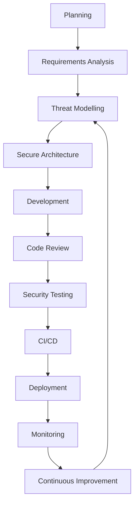
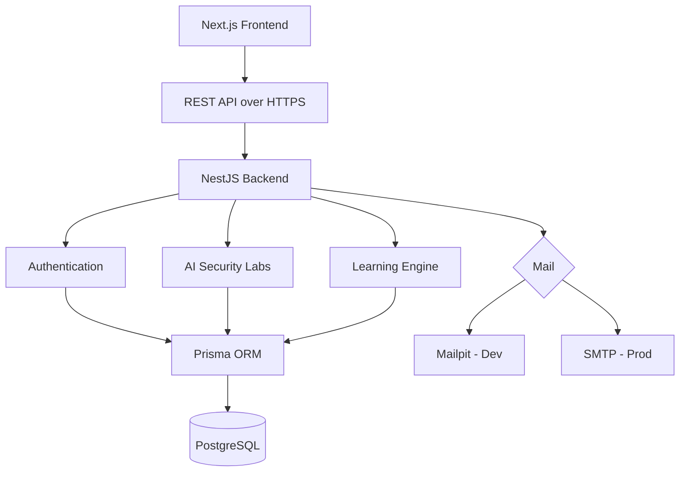

<div align="center">

# ForgeAI

### AI Security Learning Platform

**Learn AI Security by Building, Breaking, and Securing Real AI Applications**

*An open-source platform for learning AI Security, Secure SDLC, Application Security, Threat Modelling, and Secure Software Engineering through hands-on labs.*

<br>


</div>

---

## Table of Contents

- [Overview](#overview)
- [Why ForgeAI?](#why-forgeai)
- [Features](#features)
- [Technology Stack](#technology-stack)
- [Secure Software Development Life Cycle](#secure-software-development-life-cycle-ssdlc)
- [Secure Engineering Principles](#secure-engineering-principles)
- [Architecture](#architecture)
- [Repository Structure](#repository-structure)
- [Quick Start (Preview)](#quick-start-preview)
- [Roadmap](#roadmap)
- [Contributing](#contributing)
- [License](#license)
- [Author](#author)

---

## Overview

ForgeAI is an open-source AI Security Learning Platform designed to help developers, security engineers, penetration testers, students, and researchers understand modern AI security through practical, hands-on experience.

Rather than teaching security through theory alone, ForgeAI provides intentionally vulnerable AI applications alongside secure implementations, so learners can explore real-world attack techniques, understand why they succeed, and implement effective mitigations — inspired by projects like OWASP Juice Shop, but focused specifically on AI security and secure software development.

---

## Why ForgeAI?

AI is being integrated into modern applications faster than secure development practices can keep pace. There are already excellent platforms for learning web, network, cloud, and Active Directory security — but very few dedicated environments teach developers how to build **secure AI applications**.

ForgeAI bridges that gap by combining:

- AI Security
- Application Security
- Secure SDLC
- Threat Modelling
- Secure Authentication
- Defensive Engineering
- Hands-on Learning

into a single open-source, self-hosted platform.

---

## Features

**Legend:** ✅ Done &nbsp;·&nbsp; 🚧 In Progress &nbsp;·&nbsp; 🔜 Planned

### Authentication & Access
| Feature | Status |
|---|---|
| JWT authentication | ✅ |
| Refresh token architecture | ✅ |
| Role-Based Access Control (RBAC) | ✅ |
| Secure session management (DB-backed) | ✅ |
| Email verification | ✅ |
| Password hashing (bcrypt) | ✅ |
| OAuth-ready architecture | ✅ |

### Platform & DevOps
| Feature | Status |
|---|---|
| Modular NestJS backend, DTO validation, REST API | ✅ |
| Docker support | 🚧 |
| GitHub Actions CI | 🔜 |
| Automated security workflows (SAST/SCA) | 🔜 |

### AI Security Labs
| Lab | What it teaches | Status |
|---|---|---|
| Prompt Injection | Manipulating model behaviour via crafted input | 🔜 |
| Jailbreak Attacks | Bypassing model safety constraints | 🔜 |
| Prompt Leakage | Extracting hidden system prompts / instructions | 🔜 |
| Model Theft | Extracting or replicating proprietary models | 🔜 |
| Tool Poisoning | Compromising tools an AI agent calls | 🔜 |
| MCP Security | Securing Model Context Protocol integrations | 🔜 |
| AI Agent Security | Attacking/defending autonomous agent workflows | 🔜 |
| RAG Security | Securing retrieval-augmented generation pipelines | 🔜 |
| Secure AI APIs | Designing AI-facing APIs against abuse | 🔜 |

### General Security Labs
| Lab | Status |
|---|---|
| Active Directory | 🔜 |
| API Security | 🔜 |
| Cloud Security | 🔜 |
| Kubernetes Security | 🔜 |
| Secure Coding | 🔜 |
| Detection Engineering | 🔜 |
| Purple Team Exercises | 🔜 |

### Learning Platform
| Feature | Status |
|---|---|
| Interactive courses & guided labs | 🔜 |
| Progress tracking | 🔜 |
| Gamification & leaderboards | 🔜 |
| Certificates | 🔜 |
| Instructor dashboard | 🔜 |

---

## Technology Stack

| Layer | Technologies |
|---|---|
| **Frontend** | Next.js, React, TypeScript, Tailwind CSS |
| **Backend** | NestJS, TypeScript, Prisma ORM, Passport.js, JWT |
| **Database** | PostgreSQL |
| **Auth** | JWT, Refresh Tokens, RBAC, Session Management, Email Verification |
| **Mail** | Nodemailer, Mailpit (dev), SMTP (prod) |
| **DevOps** | Docker, Docker Compose, GitHub Actions (planned) |

---

## Secure Software Development Life Cycle (SSDLC)

ForgeAI is built with security integrated into every phase of development, not bolted on afterward.



---

## Secure Engineering Principles

- Secure by Design & Security by Default
- Defence in Depth
- Least Privilege
- Zero Trust principles
- OWASP ASVS & OWASP Top 10
- Secure authentication & session management
- Threat modelling
- Clean, modular architecture

---

## Architecture



---

## Repository Structure

```
forgeai/
├── apps/
│   ├── academy-api/       # NestJS backend
│   └── academy-web/       # Next.js frontend
├── packages/               # Shared libraries/config
├── docker/                 # Docker & Compose configs
├── docs/                   # Architecture & lab documentation
├── .github/                 # Workflows, issue/PR templates
└── README.md
```

---

## Quick Start (Preview)

> ForgeAI is in active pre-release development. The steps below reflect the intended local setup and will be finalized for the v1 release.

```bash
# Clone the repository
git clone https://github.com/<your-username>/forgeai.git
cd forgeai

# Copy environment variables
cp .env.example .env

# Start services with Docker Compose
docker compose up --build

# Run database migrations
pnpm --filter academy-api prisma migrate dev

# App will be available at:
# Frontend → http://localhost:3000
# API      → http://localhost:4000
```

---

## Roadmap

- [x] **Phase 1 — Foundation:** Authentication, email verification, password reset, session management, RBAC
- [ ] **Phase 2 — Learning Platform:** Interactive courses, guided labs, progress tracking
- [ ] **Phase 3 — AI Security Labs:** Prompt injection, RAG security, MCP security, AI agent security
- [ ] **Phase 4 — Enterprise Features:** Team management, certificates, analytics, leaderboards

---

## Contributing

Contributions are welcome. Contribution guidelines, issue templates, and a pull request process will be published ahead of the first public release. In the meantime, feel free to open an issue to discuss ideas or report bugs.

---

## License

This project is licensed under the [MIT License](LICENSE).

---

## Author

**Utkarsh Barethiya** — Security Consultant & Penetration Tester, MSc Cybersecurity (First Class Honours)

Built as an open-source initiative to bridge offensive security expertise with modern secure software engineering, and to advance hands-on AI security education.

[LinkedIn](https://www.linkedin.com/in/utkarsh-barethiya) · [Portfolio](https://crackthehack.in) · [GitHub](#)

---

<div align="center">

**⭐ If you find this project interesting, consider giving it a star!**

</div>
